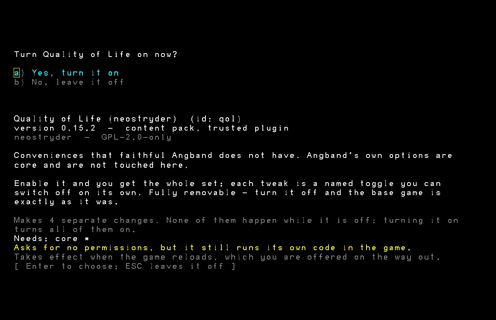

# Quality of Life

Conveniences for [Neo Angband](https://github.com/neostryder/neo-angband) that are
**not** part of faithful Angband, as a mod.

**This is a mod.** It is off until you enable it, every tweak inside it is a named
switch you can turn off on its own, and disabling the mod leaves the game exactly as
Angband 4.2.6 plays it.



## Options this mod leaves alone

It does not touch Angband's own options. Those ship in the game with their upstream
defaults, and this mod has no opinion about them: if you want `auto_more` or
`show_damage`, they are in the game's Options screen and always were. What is here is
behaviour Angband does not have.

## Available toggles

| Toggle | Default | What it does |
|---|---|---|
| **Auto-dig on walk** (`qol.autoDig`) | on | Walking into a rubble pile or mineral vein you can tunnel through starts digging, instead of just bumping into it. You still stop after each attempt and never step onto the dug-out square in the same move. |
| **Remember my settings** (`qol.rememberSettings`) | on | Changes you make in the `=` options menu are kept, and every new character starts with them. Your existing characters are never touched. |
| **Remember cheat options too** (`qol.rememberCheats`) | off | Include the cheat options in what is remembered. Off by default, because a cheat option permanently bars that character from the score list. |
| **Keep reading a pref file past a mistake** (`qol.forgivingPrefFiles`) | on | Angband stops reading a pref file at the first line it cannot understand, throwing away everything below it. With this on the file is read to the end and the bad lines are skipped. You are told about the first 20 mistakes. |
| **Hover cards on the Map overview** (`qol.mapHoverCards`) | off | On the `M` overview, resting the mouse on a cell for 2 seconds (or holding for 1 second on touch) shows a card with a magnified tile and knowledge-gated info for that cell - terrain, creature, item, trap, shop, or your character. Mouse cards close when the pointer leaves the grid; touch cards stay until you tap elsewhere. Clicks on the map box inspect instead of dismissing the overview. |
| **Zoom, pan, and responsive layout** (`qol.zoomPan`) | on | Changes the real terminal grid instead of magnifying a fixed canvas. Keyboard, mouse wheel, and two-finger gestures zoom or pan play and the `M` map; the sidebar scales separately and uses fitted pages on narrow screens. |
| **Sharpen zoomed graphics** (`qol.sharpenZoomedTiles`) | off | Uses nearest-neighbour sampling when a graphics tile is reduced. Pixel-art edges become crisper; ASCII is unchanged. |
| **Accessibility: enlarged display** (`qol.accessibilityZoom`) | off | Opt in to the enlarged-display accommodation independently. The visual behaviour arrives with the associated accommodation update. |
| **Accessibility: high-contrast display** (`qol.accessibilityHighContrast`) | off | Opt in to high-contrast rendering independently. The visual behaviour arrives with the associated accommodation update. |
| **Accessibility: activation shortcut helper** (`qol.accessibilityMacroWizard`) | off | Opt in to the activation-shortcut helper independently. The helper arrives with the associated accommodation update. |

The mod exists as its own repository because a mod that is going to grow should not
need a game release to do it, and because a third-party mod and a first-party one
should be the same shape, installed by the same code, gated by the same checks.

The current mod needs engine 1.4.0 or later (`"engine": ">=1.4.0"`). That is
the first engine version with both the display-geometry seam used by zoom and pan
and the visual-filter seam used by the rendering accommodations.

### Accessibility accommodations

Accessibility accommodations are separate opt-in mod rules, so enabling one does
not turn on the others. Choose them in **Mods -> Quality of Life** before
starting a character, then apply the changes and reload. The mod API's `rules`
surface is the player-configurable option mechanism available to mods; it does
not add arbitrary entries to the core `=` birth-options editor. The three visual
choices establish stable independent flags. Enlarged display starts the responsive
grid at a 36-pixel cell height even when the separate zoom-and-pan rule is off;
your saved normal zoom preference is not changed. High contrast applies a contrast
and saturation boost to the rendered terminal frame. Colourblind correction applies
a red-green daltonization colour matrix to that frame. Both filters work in ASCII
and graphics modes, across dungeon play, the `M` map, menus, and other terminal-grid
screens; the Quality of Life status sidebar and Map hover cards receive the same
filter because they are separate DOM layers. The activation-shortcut helper remains
reserved for its own future update.

### Zoom, pan, and responsive layout

This is real grid reflow. A larger zoom step makes every glyph or tile larger
and therefore shows fewer cave cells; a smaller step exposes more cave cells.
The terminal, camera, full-level map, pointer conversion, and world frame all
use the resulting whole-cell geometry. There is no CSS transform and no
fractional cave offset.

- `Ctrl-=` and `Ctrl--` zoom the play grid. Zoom resets a manually
  panned play camera so the player returns to the natural view. On the `M` map,
  the same keys step from whole-level fit through three detail levels.
- `Ctrl-Arrow` pans play or the `M` map by two cave cells. Panning a fitted map
  first enters its broadest detail level, because a full-level fit has no
  off-screen cave cells to reveal.
- Hold `Shift` with either keyboard zoom key to scale the interface instead
  (`Ctrl-Shift-=` produces `Ctrl-+`). `Ctrl-Wheel` targets the sidebar when the
  pointer is over it and the play or map view everywhere else.
- A two-finger gesture is assigned by its starting midpoint. Pinch on the view
  zooms it and a two-finger swipe pans it; on the sidebar, pinch scales the text
  and a two-finger swipe changes the fitted status page.

The ordinary roomy layout keeps all status lines at the top-left when they fit.
If its height is short, or if the grid falls below 48 columns and changes to a
top strip, the sidebar shows as many complete entries as fit plus a page button.
The button and a two-finger swipe reach the remaining pages. It never uses a
horizontal or vertical scrollbar. Reflow normally honors the selected cell
height, but can reduce it enough to preserve at least a 20 by 12 terminal on a
very small display. Phone layouts reserve at least 24 columns so short footer
prompts remain complete.

The responsive terminal is centered in both axes. Its outer margins absorb the
few pixels left after fitting complete rows and columns, so an edge never shows
part of a cell. Every resize or phone rotation refits the grid immediately. Map
width, height, zoom windows, and pan origins finish on whole cells and are also
rounded to even spans or offsets where the level bounds permit. The title stays
in the engine's own centered 80 by 24 fit and ignores the saved gameplay zoom;
gameplay reflow starts only when the character HUD appears. Footer prompts,
character sheets, knowledge lists, and help remain terminal content. Those
text-heavy screens temporarily use the centered fixed terminal fit so their
80-column compositions stay complete, then restore gameplay reflow when the
HUD returns. None of these layouts uses a browser scrollbar.

The zoom level, interface scale, and map detail are one install-wide device
preference in `ctx.prefs`, shared by every character and save. It lives beside
the remembered-options data in the same versioned value, so upgrading from the
old direct options shape retains those options rather than replacing them.
Neither zoom nor sidebar rendering adds a transition or animation, so reduced
motion preferences need no exception path.

Graphics downscaling normally keeps the engine's high-quality interpolation.
The separate sharpening toggle changes that sampler to nearest-neighbour. It is
off by default because which version reads better depends on the tileset and
zoom level, while the automatic mode is the less surprising general default.

### Why remembering settings belongs in a mod

Angband keeps a character's options inside that character's save and nowhere else, so
they die with the character, and every new life starts by setting them all again.
Upstream's answer is the pref file (`s` / `r` in the options menu), a file you have to
know exists and remember to write. That is not a bug either, so core keeps it, and the
convenience lives here.

It needs three things from the engine, and all three are general seams rather than
anything named after this mod: `ModHooks.optionsChanged` (the game says when you have
finished changing settings), `ctx.prefs` (somewhere to keep data that outlives a
character; the mod's save bag is *inside* the save and dies with it), and
`ctx.newCharacter` (whether this character was just created, which a mod cannot work
out for itself because the game autosaves the moment one is born).

Three deliberate exclusions. **Birth options** are frozen at creation and the engine
refuses to change them afterwards, and they already carry forward by the game's own route,
because the birth options editor is seeded from your last character. **Cheat and score
options** are excluded unless you turn the second toggle on: switching a cheat option
on forces its `score_` twin, which permanently bars that character from the high score
list, and inheriting that without being asked is the one case where remembering a
setting does real damage. The filter applies when settings are read back as well as
when they are stored, so turning the toggle off takes effect against what is already
saved.

### Why pref-file error handling belongs in a mod

Angband 4.2.6 stops dead at the first line of a pref file it cannot parse:
`process_pref_file_named` prints one error and breaks out of the read loop
(`ui-prefs.c`). One typo near the top of a converted graphics pack therefore
costs you the whole rest of the pack, silently. That is a wart, not a bug, so
core keeps it.

The engine used to be forgiving instead: it carried a twenty-error cap of its
own, with an environment variable to change it. A citation sweep found no such
thing anywhere in Angband 4.2.6, which made it an improvement the port had added
rather than a behaviour it had reproduced, and the port adds nothing. So it was
removed from the engine and rebuilt here, better than it was: the old cap still
threw away everything below the twentieth error, and this one applies the entire
file and only limits what you are **told**.

It needs one general seam, named after nothing in this mod:
`setPrefErrorPolicy`. It is a module-level policy rather than a `ModHooks`
member because the three readers it governs (the `=` menu's "Load a user pref
file", a mod's own `prefs` resource and the graphics pack loader) have no game
state to hang a hook on, and two of them run before there is a game at all.

### Why auto-dig belongs in a mod

Faithful 4.2.6 spends no energy when you walk into diggable terrain: you bump it and
nothing happens. That is not a bug, it is what the C does
(`move_player`, `cmd-cave.c`), and Neo Angband's rule is that core keeps the warts. So
the behaviour lives here, and it lives here *completely*: there is no `qol.autoDig`
string and no dig-on-walk branch anywhere in the engine. Delete this mod and the code
is gone, not merely switched off.

It reaches two of the engine's own public functions rather than reimplementing them
(`movementTunnelTest` for the decision, `tunnelAux` for the attempt), because a
reimplemented dig roll would drift from the tunnel command's. The decision half draws
no randomness, so a walk this mod declines to handle leaves the RNG stream exactly
where faithful core would, which is what makes it safe to enable partway through a
character.

### Why Map overview hover cards belong in a mod

The `M` command already draws the whole level in miniature, scaled down, with
the same knowledge gate the main screen uses - remembered terrain, remembered
or sensed objects, visible or detected monsters. What it has never had is a
way to inspect one cell of that miniature once it is small enough to need one.

This toggle adds that inspection, and nothing the main screen would not
already show: the card's text comes from the same look-command machinery that
answers "what do I know about this grid" everywhere else in the game, so a
card never reveals anything identify or memory has not already earned. The
kind label (terrain, creature, item, trap, shop, character) is derived from
that same look result plus the live feature/player grid, and the magnified
tile is cropped from the graphics overview overlay when one is mounted,
otherwise from the matching terminal cell on the game canvas.

Mouse and touch both work. A two-second mouse dwell opens a card that closes
when the pointer leaves that grid; a one-second touch hold opens a card that
stays until a tap elsewhere. While the pointer is over the map box, this mod
stops the overview's ordinary click-to-dismiss so inspection is possible; any
key still closes the map, matching the footer's "Hit any key to continue".
Off by default, like any toggle here.

## Installing

Two files: `manifest.json` and `plugin.js`. Any of:

- **In the game** - Mods -> **Install a mod...**, which fetches this repository at a
  release tag, never a branch, so what arrives cannot change under you afterwards. The
  install records a SHA-256 of every byte that arrived, which is what lets the manager
  answer later whether the copy on your machine has changed. It cannot tell you whether
  what arrived is what was published here, there being nothing to compare a first
  download against. This is the path that works in every browser, including the ones
  with no directory picker.
- **A folder** - clone this repository into your mods directory, or point the browser
  build at it with **Load mod folder**.

`plugin.js` is generated from `plugin.ts` in this repository. It is committed because
that is what an install fetches. Edit the source, not this file, and if you are
reading it to decide whether to trust it, that is exactly why it ships unminified.

## Building and testing the mod

The source lives here now, and so do the tests. They boot a **real game** against the
published engine (`@rpgm-tools/neo-angband-core`) rather than a fake, because a
convenience proven against a hand-built cave is a convenience proven against a fixture.

```bash
pnpm install --frozen-lockfile
```

```bash
pnpm verify
```

That typechecks, runs the tests, and confirms the committed `plugin.js` is a current
build of the source. An install fetches the committed `plugin.js` from a pinned tag
and runs it as it is; nothing rebuilds it on the way in. A stale artefact can pass the
other checks and still be the file players run, so `pnpm check` is the only check that
examines it.

No checkout of the game is needed. The engine, the content pack (Angband 4.2.6
gamedata, which the tests generate levels from) and the plugin builder are all
published packages, so `pnpm install --frozen-lockfile` is the whole setup. The suite
proves this mod against exactly what a third-party author would install. A sibling checkout of
[neo-angband](https://github.com/neostryder/neo-angband), or `NEO_ANGBAND_REPO`
pointing at one, is an override for developing against an engine change that has not
reached the registry yet.

```bash
pnpm build     # rebuild plugin.js after editing plugin.ts
```

### Testing against an unreleased engine

By default the tests import the **published** engine from `node_modules` - the
version a player runs, which is the right default and the reason the dependency
is pinned rather than linked. When you need to run against an engine change that
has not shipped yet:

```bash
NEO_ANGBAND_LOCAL_CORE=1 pnpm test
```

That resolves `@rpgm-tools/neo-angband-core` to `packages/core/dist` in the sibling
checkout (build it first). It is a separate variable from `NEO_ANGBAND_REPO` on
purpose: nearly everyone here has the checkout already, so keying off its presence
would silently swap the engine under every run. If `NEO_ANGBAND_REPO` is set it is
authoritative - a wrong path fails rather than falling back to a checkout you did
not name.

## Releasing

A tag matching `vX.Y.Z` is the release: there is no separate publish step. A
minor or major bump posts an announcement to the RPGM Tools Discord's Neo
Angband announcements forum automatically, built from the matching
[CHANGELOG.md](CHANGELOG.md) heading. A patch-only bump stays quiet by design.

## Support and bug reports

[**The RPGM Tools Discord**](https://discord.gg/YegtwbHTBQ) is the fastest way
to ask anything - whether a behaviour is intended, how to get this installed,
or what you should try next. No GitHub account needed.

[Open an issue here](../../issues/new/choose) for a bug in **this mod**. Two
things belong against the game instead, and the forms will point you there: the
mod **system** (an install that fails, a load order that will not stick, a
conflict report that looks wrong), and the game **not matching Angband 4.2.6**
once this mod is switched off - changing the game is what a mod is for.

For anything that should not be public, including a security report:
**strider-angband (at) rpgm.tools**. See
[SECURITY.md](https://github.com/neostryder/neo-angband/blob/master/SECURITY.md).

Asking about AI use in this project? [AI_USAGE_POLICY.md](AI_USAGE_POLICY.md) is
the complete answer.

[TERMS.md](TERMS.md) covers use of this mod. The core repository's
[PRIVACY.md](https://github.com/neostryder/neo-angband/blob/master/PRIVACY.md)
covers what is stored and what network requests the game makes. Project
participation is subject to the shared [CODE_OF_CONDUCT.md](CODE_OF_CONDUCT.md).

## Licence

Same dual licence as Neo Angband and Angband: GPL v2 or the Angband licence. See
[LICENSE.md](LICENSE.md).

## Credits

Built by neostryder / RPGM Tools as part of Neo Angband. Auto-dig is ported from
neostryder's own Angband fork. Angband is the work of Ben Harrison, James E. Wilson,
Robert A. Koeneke and the Angband contributors.
