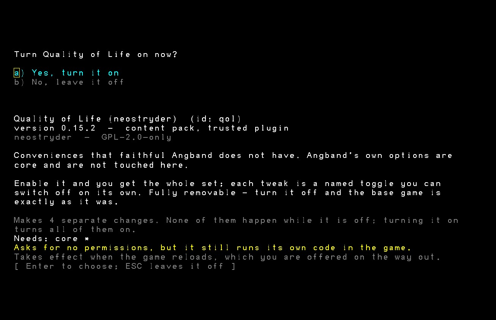

# Quality of Life

Conveniences for [Neo Angband](https://github.com/neostryder/neo-angband) that are
**not** part of faithful Angband, as a mod.

**This is a mod.** It is off until you enable it, every tweak inside it is a named
switch you can turn off on its own, and disabling the mod leaves the game exactly as
Angband 4.2.6 plays it.



## Options this mod leaves alone

It does not touch Angband's own options. Those ship in the game with their upstream
defaults, and this mod has no opinion about them: if you want `auto_more` or
`show_damage`, they are in the game's Options screen and always were. What is here is
behaviour Angband does not have.

## Available toggles

See the [settings reference](SETTINGS.md) for every flag, its default, and when a change takes effect.

| Toggle | Default | What it does |
|---|---|---|
| **Auto-dig on walk** (`qol.autoDig`) | on | Walking into a rubble pile or mineral vein you can tunnel through starts digging, instead of just bumping into it. You still stop after each attempt and never step onto the dug-out square in the same move. |
| **Remember my settings** (`qol.rememberSettings`) | on | Changes you make in the `=` options menu are kept, and every new character starts with them. Your existing characters are never touched. |
| **Remember cheat options too** (`qol.rememberCheats`) | off | Include the cheat options in what is remembered. Off by default, because a cheat option permanently bars that character from the score list. |
| **Keep reading a pref file past a mistake** (`qol.forgivingPrefFiles`) | on | Angband stops reading a pref file at the first line it cannot understand, throwing away everything below it. With this on the file is read to the end and the bad lines are skipped. You are told about the first 20 mistakes. |
| **Hover cards on the Map overview** (`qol.mapHoverCards`) | off | On the `M` overview, resting the mouse on a cell for 2 seconds (or holding for 1 second on touch) shows a card with a magnified tile and knowledge-gated info for that cell - terrain, creature, item, trap, shop, or your character. Mouse cards close when the pointer leaves the grid; touch cards stay until you tap elsewhere. Clicks on the map box inspect instead of dismissing the overview. |
| **First-encounter alerts** (`qol.firstEncounterAlerts`) | off | The first time this character meets a monster type, or picks up an artifact, a small card appears in the corner with its name and native depth. A monster's card also shows a threat badge - Unique, Deadly, Out of depth, or First sighting. The card takes no keypress and no click meant for the game, and clears itself after a few seconds or its own close button. Reported by `Wozar` on r/angband (#56). |
| **Zoom, pan, and responsive layout** (`qol.zoomPan`) | on | Changes the real terminal grid instead of magnifying a fixed canvas. Keyboard, mouse wheel, and two-finger gestures zoom or pan play and the `M` map; the sidebar scales separately and uses fitted pages on narrow screens. |
| **Sharpen zoomed graphics and Map overview** (`qol.sharpenZoomedTiles`) | off | Uses nearest-neighbour sampling when a graphics tile is reduced, making pixel-art edges crisper. It also keeps every known dungeon grid on the `M` overview and smoothly reduces the completed picture to fit in ASCII and graphics modes. |
| **Accessibility: enlarged display** (`qol.accessibilityZoom`) | off | Opt in to the enlarged-display accommodation independently. The visual behaviour arrives with the associated accommodation update. |
| **Accessibility: high-contrast display** (`qol.accessibilityHighContrast`) | off | Opt in to high-contrast rendering independently. The visual behaviour arrives with the associated accommodation update. |
| **Accessibility: activation shortcut helper** (`qol.accessibilityMacroWizard`) | off | When you gain a spell or known activation, offers an unused shortcut key for the casting or activation command. You may accept, choose another key, or decline. |
| **Accessibility: repeated-action shortcuts** (`qol.accessibilityRepeatShortcuts`) | off | Offers an unused one-key shortcut for resting as needed. Existing shortcuts are never replaced. Reported by `misha_cilantro`. |
| **Purge queued input** (`qol.purgeQueuedInput`) | off | Claims an unused key (F2, if nothing else already has it) that sends Escape for you - enough presses at once to back out of several stacked menus or prompts. Holding the key down sends it only once; a genuine burst of separate presses sends it again each time. |
| **Quality ignore: always ignore torches** (`qol.ignoreTorches`) | off | Treats every Wooden Torch as ignored, independent of whatever quality tier you have set for light sources and of the matching lantern toggle below. A real torch artifact, or one inscribed `!k` or `!*`, is never ignored by this. |
| **Quality ignore: always ignore lanterns** (`qol.ignoreLanterns`) | off | Treats every Lantern as ignored, independent of whatever quality tier you have set for light sources and of the matching torch toggle above - useful when only torches are floor noise, such as a build that refuels a Lantern of Shadows from lanterns found on the ground. A real lantern artifact, or one inscribed `!k` or `!*`, is never ignored by this. Reported by `WikiWantsYourPics` on r/angband (#267). |

The mod exists as its own repository because a mod that is going to grow should not
need a game release to do it, and because a third-party mod and a first-party one
should be the same shape, installed by the same code, gated by the same checks.

### Cloud backups

Open the Escape **Game menu** and choose **Choose cloud-backup folder...** to pick a folder that a cloud-sync service watches. Once a folder is chosen, every successful save updates that character's importable backup there. The row shows the folder's name and how many characters it already recognises in it, since setting up a second machine often means picking an existing Dropbox folder full of them. Choosing a different folder replaces the old choice, and cancelling the picker changes nothing. If your browser or the desktop app cannot offer a folder picker, the row is hidden.

On a build that also watches for new arrivals, opening the character-select screen offers any character in that folder that this machine does not have yet. It is a plain yes/no question and goes through the same import as Shift-M, so a character that died on this machine is still refused, just as a manual import would refuse it. Saying no leaves the file alone, and it is offered again the next time the screen opens.

The current mod needs engine 1.6.0 or later (`"engine": ">=1.6.0"`). That is the first engine version that tells mods when you gain a new ability, lets a mod add keymaps with your consent (both used by the activation shortcut helper), and has the display and filter hooks the visual accommodations use.
### Accessibility accommodations

Each accessibility accommodation is its own opt-in rule, so turning one on does not turn on the others. Choose them in **Mods -> Quality of Life** before starting a character, then apply the changes and reload. They live in the mod's own settings because mods cannot add entries to the game's `=` birth-options screen.

The three visual options are independent of each other. Enlarged display starts the responsive grid at a 36-pixel cell height even when the separate zoom-and-pan option is off, and it does not change your saved normal zoom. High contrast boosts the contrast and saturation of the rendered terminal. Colourblind correction applies a red-green daltonization colour matrix to the same picture. Both filters work in ASCII and graphics modes, in the dungeon, on the `M` map, in menus and on other terminal screens, and the Quality of Life status sidebar and Map hover cards get the same filter applied separately.

The activation-shortcut helper opens a window after you learn a spell or gain a known activatable item. It suggests an unused function key, lets you type a different unused printable key, `Enter`, or any of `F1` through `F12`, and lets you decline. A bound shortcut opens the ordinary casting or activation command, so the game's normal item, spell, aiming and safety choices still apply.

The repeated-action helper offers `R&[Enter]` for conditional rest, the one command here that costs more than a key or two every time you use it. A cardinal run gets no shortcut: it is already `.` plus a direction in the original keyset, or one shifted direction key in the roguelike keyset, so a bound key would not save anything. Resting keeps its usual interruption checks either way. Existing keymaps are never replaced.
### Zoom, pan, and responsive layout

Zooming changes the actual grid instead of magnifying the picture. A larger zoom step makes every glyph or tile bigger and shows fewer cave cells; a smaller step shows more. The terminal, camera, full-level map, mouse position and world frame all work in whole cells, so nothing is ever drawn at a fractional offset.

- `Ctrl-=` and `Ctrl--` zoom the play grid. Zooming also resets a camera you panned by hand, so the view returns to its normal position around you. On the `M` map, the same keys step from a whole-level fit through three detail levels.
- `Ctrl-Arrow` pans play or the `M` map by two cave cells. Panning a fitted map first switches to its broadest detail level, since a whole-level fit has nothing off-screen to reveal.
- Hold `Shift` with either keyboard zoom key to scale the interface instead (`Ctrl-Shift-=` produces `Ctrl-+`). `Ctrl-Wheel` scales the sidebar when the pointer is over it and zooms the play or map view everywhere else.
- A two-finger gesture acts on whatever is under its starting midpoint. On the view, pinch zooms and a two-finger swipe pans; on the sidebar, pinch scales the text and a two-finger swipe turns the status page.

In the normal roomy layout, all status lines sit at the top-left when they fit. If the screen is short, or the grid drops below 48 columns and the sidebar becomes a strip across the top, the sidebar shows as many complete entries as fit plus a page button, and the button or a two-finger swipe reaches the other pages. Reflow normally keeps your chosen cell height, but will shrink it enough to keep at least a 20 by 12 terminal on a very small display, and phone layouts reserve at least 24 columns so short prompts at the bottom stay whole.

The terminal is centred both ways, and the few pixels left over after fitting whole rows and columns go into the outer margins, so no edge ever shows part of a cell. Resizing the window or rotating a phone refits the grid immediately. Map width, height, zoom windows and pan positions land on whole cells and, where the level bounds allow, on even spans or offsets. The title screen uses the engine's own centred 80 by 24 layout and ignores your gameplay zoom; reflow starts once the character HUD appears. Footer prompts, character sheets, knowledge lists and help are text-heavy terminal screens, so they temporarily switch to the centred fixed layout to keep their 80-column pages intact, and reflow comes back when the HUD returns. None of these layouts ever shows a scrollbar.
Zoom level, interface scale and map detail are saved once for the whole install and shared by every character and save. They are stored alongside the remembered options in the same versioned setting, and upgrading from the older format keeps your remembered options. Zooming and the sidebar use no transitions or animations, so reduced-motion settings need no special handling.

When graphics tiles are shrunk, the engine normally uses its high-quality smoothing. The separate sharpening toggle switches to nearest-neighbour sampling instead. It is off by default because which looks better depends on the tileset and zoom level, and smoothing is the less surprising default.
### Why remembering settings belongs in a mod

Angband keeps a character's options inside that character's save and nowhere else, so they die with the character and every new life starts by setting them all again. Upstream's answer is the pref file (`s` / `r` in the options menu), which you have to know about and remember to write. That is how Angband works rather than a bug, so the game keeps it and the convenience lives here.

The mod uses three general engine features, none of them specific to this mod: a notice when you finish changing settings (`ModHooks.optionsChanged`), a place to keep data that outlives a character (`ctx.prefs`, since a mod's save bag is inside the save and dies with it), and a way to tell whether a character was just created (`ctx.newCharacter`, which a mod cannot work out for itself because the game autosaves the moment a character is born).

There are three exclusions. **Birth options** are fixed at creation and the engine will not change them later, and they already carry forward by the game's own route, because the birth options editor starts from your last character's choices. **Cheat and score options** are left out unless you turn on the second toggle: switching a cheat option on forces its `score_` twin, which permanently bars that character from the high score list, and inheriting that without being asked is the one case where remembering a setting does real damage. The filter applies when settings are read back as well as when they are stored, so turning the toggle off also affects what is already saved.
### Why pref-file error handling belongs in a mod

Angband 4.2.6 stops at the first line of a pref file it cannot parse: it prints one error and stops reading. One typo near the top of a converted graphics pack costs you the whole rest of the pack, with only that one error to show for it. That is a wart rather than a bug, so the game keeps it.

The engine used to carry its own cap of twenty errors, with an environment variable to change it. Angband 4.2.6 has nothing like that, so the cap was something the port had added rather than reproduced, and the port adds nothing. It was removed from the engine and rebuilt here with one improvement: the old cap still threw away everything after the twentieth error, while this toggle applies the entire file and only limits how many mistakes you are **told** about.

For mod authors: the mod uses one general engine setting, `setPrefErrorPolicy`. It is a module-level policy rather than a `ModHooks` member because the three readers it governs (the `=` menu's "Load a user pref file", a mod's own `prefs` resource and the graphics pack loader) have no game state to hang a hook on, and two of them run before there is a game at all.
### Why auto-dig belongs in a mod

In Angband 4.2.6, walking into diggable terrain spends no energy: you bump it and nothing happens. That is what the original C code does, and Neo Angband keeps behaviour like that in the base game, so auto-dig lives entirely in this mod. The engine has no auto-dig setting and no dig-on-walk code, so deleting this mod deletes the feature's code with it.

For mod authors: the mod calls two of the engine's public functions instead of reimplementing them, `movementTunnelTest` to decide and `tunnelAux` to make the attempt, so its dig roll cannot drift from the tunnel command's. The decision step uses no randomness, so when the mod declines a walk, the random number stream is exactly where the unmodded game would leave it, which makes the toggle safe to enable partway through a character.
### Why Map overview hover cards belong in a mod

The `M` command already draws the whole level in miniature, with the same knowledge rules as the main screen: remembered terrain, remembered or sensed objects, and visible or detected monsters. It has never had a way to inspect a single cell once the map is that small.

This toggle adds that, and shows nothing the main screen would not. A card's text comes from the same look command the rest of the game uses, so it never reveals anything that identification or memory has not already given you. The card's kind label (terrain, creature, item, trap, shop or character) comes from the same look result plus what is on that grid, and the magnified tile is taken from the graphics overview when one is showing, or from the matching cell of the game screen otherwise.

Mouse and touch both work. Resting the mouse on a cell for two seconds opens a card that closes when the pointer leaves that cell; holding a finger on one for a second opens a card that stays until you tap elsewhere. While the pointer is over the map, clicking no longer closes the overview, so you can inspect; any key still closes the map, as the footer's "Hit any key to continue" says. Off by default, like any toggle here.
### Why first-encounter alerts belong in a mod

Angband already remembers every monster type you have ever met (the `r`ecall
screen) and every artifact you have ever identified, but nothing puts either
fact in front of you at the moment it happens. A mid-to-late-game run spends
most of its time walking past monsters the player already knows, so the one
that is genuinely new - an out-of-depth wanderer, or a unique - reads as just
another glyph on the map unless something calls it out.

This toggle calls it out. The first time this character's line of sight or
telepathy includes a monster race, or the first time an artifact in their
gear is assessed, a card appears with the monster or artifact's name and
native depth. A monster's card also carries a threat badge: `Unique!` for any
unique regardless of depth, `Deadly` for one five or more levels out of
depth, `Out of depth` for one merely below the current depth, and
`First sighting` for everything else, so the same glance that says "new"
also says "should I be worried". The card is a non-modal panel: it takes no
keypress, and only the card itself (not the transparent layer behind it)
takes a pointer event, so it never costs a turn or blocks a click meant for
the dungeon underneath. It clears itself after a few seconds, or immediately
on its own close button.

Tracked per character rather than per install: starting a new character sees
every card again, because a fresh run is exactly when noticing an
out-of-depth monster matters most. Reported by `Wozar` on r/angband, who also
proposed extending the same notice to a first artifact find (#56).

## Installing

Two files: `manifest.json` and `plugin.js`. Any of:

- **In the game** - Mods -> **Install a mod...**, which fetches this repository at a
  release tag, never a branch, so what arrives cannot change under you afterwards. The
  install records a SHA-256 of every byte that arrived, which is what lets the manager
  answer later whether the copy on your machine has changed. It cannot tell you whether
  what arrived is what was published here, there being nothing to compare a first
  download against. This is the path that works in every browser, including the ones
  with no directory picker.
- **A folder** - clone this repository into your mods directory, or point the browser
  build at it with **Load mod folder**.

`plugin.js` is generated from `plugin.ts` in this repository. It is committed because
that is what an install fetches. Edit the source, not this file, and if you are
reading it to decide whether to trust it, that is exactly why it ships unminified.

## Building and testing the mod

The source and the tests live in this repository. The tests boot a real game against the published engine (`@rpgm-tools/neo-angband-core`) instead of a hand-built test cave.

```bash
pnpm install --frozen-lockfile
```

```bash
pnpm verify
```

That typechecks, runs the tests, and confirms the committed `plugin.js` is a current build of the source. An install fetches the committed `plugin.js` from a pinned tag and runs it as it is, without rebuilding it, so a stale build could pass the other checks and still be the file players run. `pnpm check` is the only check that examines it.

You do not need a checkout of the game. The engine, the content pack (Angband 4.2.6 gamedata, which the tests generate levels from) and the plugin builder are all published packages, so `pnpm install --frozen-lockfile` is the whole setup, and the tests run against exactly what a third-party author would install. A sibling checkout of [neo-angband](https://github.com/neostryder/neo-angband), or `NEO_ANGBAND_REPO` pointing at one, is only for developing against an engine change that has not reached the registry yet.

```bash
pnpm build     # rebuild plugin.js after editing plugin.ts
```
### Testing against an unreleased engine

By default the tests import the published engine from `node_modules`, the same version a player runs, which is why the dependency is pinned rather than linked. To run against an engine change that has not shipped yet:

```bash
NEO_ANGBAND_LOCAL_CORE=1 pnpm test
```

That resolves `@rpgm-tools/neo-angband-core` to `packages/core/dist` in the sibling checkout (build it first). It is a separate variable from `NEO_ANGBAND_REPO` because most contributors already have the checkout, and switching engines just because it exists would change the engine under every run without anyone noticing. If `NEO_ANGBAND_REPO` is set, it takes precedence, and a wrong path fails instead of falling back to a checkout you did not name.

## Releasing

A tag matching `vX.Y.Z` is the release: there is no separate publish step. A
minor or major bump posts an announcement to the RPGM Tools Discord's Neo
Angband announcements forum automatically, built from the matching
[CHANGELOG.md](CHANGELOG.md) heading. A patch-only bump stays quiet by design.

## Support and bug reports

[**The RPGM Tools Discord**](https://discord.gg/YegtwbHTBQ) is the fastest way
to ask anything - whether a behaviour is intended, how to get this installed,
or what you should try next. No GitHub account needed.

[Open an issue here](../../issues/new/choose) for a bug in **this mod**. Two
things belong against the game instead, and the forms will point you there: the
mod **system** (an install that fails, a load order that will not stick, a
conflict report that looks wrong), and the game **not matching Angband 4.2.6**
once this mod is switched off - changing the game is what a mod is for.

For anything that should not be public, including a security report:
**strider-angband (at) rpgm.tools**. See
[SECURITY.md](https://github.com/neostryder/neo-angband/blob/master/SECURITY.md).

Asking about AI use in this project? [AI_USAGE_POLICY.md](AI_USAGE_POLICY.md) is
the complete answer.

[TERMS.md](TERMS.md) covers use of this mod. The core repository's
[PRIVACY.md](https://github.com/neostryder/neo-angband/blob/master/PRIVACY.md)
covers what is stored and what network requests the game makes. Project
participation is subject to the shared [CODE_OF_CONDUCT.md](CODE_OF_CONDUCT.md).

## Licence

Same dual licence as Neo Angband and Angband: GPL v2 or the Angband licence. See
[LICENSE.md](LICENSE.md).

## Credits

Built by neostryder / RPGM Tools as part of Neo Angband. Auto-dig is ported from
neostryder's own Angband fork. Angband is the work of Ben Harrison, James E. Wilson,
Robert A. Koeneke and the Angband contributors.
